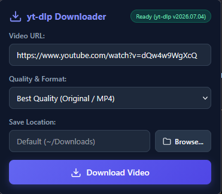

# 🎬 yt-dlp Video Downloader (Universal Browser Extension)

<p align="left">
  
  
  
  
  
  
  
  
</p>

A fast, lightweight, and local browser extension for **Mozilla Firefox, Google Chrome, Microsoft Edge, Brave, and Opera** to download videos and audio from YouTube, Twitch, and over 1,000+ supported websites directly via [yt-dlp](https://github.com/yt-dlp/yt-dlp) – 100% free, ad-free, without file size limits or third-party cloud servers.

<p align="center">
  
</p>

---

## ✨ Features

- ⚡ **1-Click Download**: Automatically detects the video URL from your active browser tab.
- 📁 **Custom Download Folder**: Choose any save directory directly from the extension with a native **Browse...** folder picker.
- 🎛️ **Format & Quality Selection**:
  - Best available video & audio (Original)
  - 1080p Full HD (MP4 / H.264)
  - 720p HD (MP4 / H.264)
  - Audio extraction to MP3 (via FFmpeg)
- 📊 **Real-Time Progress & ETA**: Live download percentage, transfer speed (MiB/s), and estimated time remaining.
- 🌐 **Cross-Browser Compatible**: Built on WebExtensions Manifest V3 for Firefox, Chrome, Edge, Brave, Opera, and Vivaldi.
- 🔒 **100% Local & Private**: Direct communication with your local Python environment via Native Messaging. No data is ever sent to external servers.
- 🔄 **Permanent Setup**: One-time installation without having to re-enable the extension every time your browser restarts.

---

## 🛠️ Prerequisites

1. **Python 3.8+** installed on your system ([python.org](https://www.python.org/downloads/))  
   *(Make sure to check the box **"Add Python to PATH"** during installation!)*
2. **yt-dlp & imageio-ffmpeg**:
   ```bash
   pip install yt-dlp imageio-ffmpeg
   ```

---

## 🚀 Quick Installation (In Under 2 Minutes)

### Step 1: Get the files
* **Option A (Users ⭐)**: Download the latest **`yt-dlp-downloader-v1.0.0-windows.zip`** from [GitHub Releases](https://github.com/toml15/-Video-downloader-extension-yt-dlp/releases) and extract it to a permanent folder on your computer (e.g. in your Documents).
* **Option B (Developers)**:
  ```bash
  git clone https://github.com/toml15/-Video-downloader-extension-yt-dlp.git
  cd -Video-downloader-extension-yt-dlp
  ```

---

### Step 2: Run 1-Click Setup
Double-click **`install_all.bat`**.

This installer will:
1. Register the Native Messaging Host in your Windows Registry for **all browsers** (Firefox, Chrome, Edge, Brave).
2. Guide you through activating the extension in your preferred browser.

---

### Step 3: Browser Activation

#### 🦊 Mozilla Firefox:
- Choose option **`[1]`** in `install_all.bat` (or right-click `setup_permanent.bat` ➔ *Run as Administrator*).
- This creates an official *Firefox Enterprise Policy* in your Firefox distribution folder.
- Restart Firefox ➔ **The add-on is permanently installed!**

#### 🌐 Google Chrome / Brave / Opera / Vivaldi:
1. Open your browser and navigate to `chrome://extensions` (or `brave://extensions`).
2. Toggle on **Developer mode** in the top-right corner.
3. Click **Load unpacked**.
4. Select the **`extension`** folder from the repository.
5. Done! The extension remains permanently active across all restarts.

#### 🌊 Microsoft Edge:
1. Navigate to `edge://extensions`.
2. Turn on **Developer mode** in the left sidebar.
3. Click **Load unpacked** and select the **`extension`** folder.

---

## 📁 Project Scripts Overview

| Script | Description |
|---|---|
| **`install_all.bat`** | **1-Click Master Installer**: Registers Native Host for all browsers and sets up permanent Firefox policy. |
| **`install_host.bat`** | Registers the Python Native Messaging Host (`ytdlp_native_host`) in the Windows Registry. |
| **`setup_permanent.bat`** | Configures Firefox Enterprise Policy (`distribution\policies.json`) with Administrator elevation. |
| **`uninstall.bat`** | Clean uninstaller: Removes all registry keys and enterprise policies from your system. |
| **`build_release.bat`** | Builds clean release packages (`.zip` and `.xpi`) in the `release/` folder for GitHub Releases. |

---

## 💡 How It Works (Architecture)

```
┌──────────────────────────────┐
│       Browser Popup UI       │  (popup.html / popup.js)
│  (URL, Quality, Save Folder) │
└──────────────┬───────────────┘
               │ Native Messaging (JSON stdio)
┌──────────────▼───────────────┐
│     Native Messaging Host    │  (ytdlp_native_host.py)
│ (Windows Folder Picker / CLI)│
└──────────────┬───────────────┘
               │ Subprocess execution
┌──────────────▼───────────────┐
│       yt-dlp & FFmpeg        │  (Direct local download & convert)
│  ───► Your Downloads Folder  │
└──────────────────────────────┘
```

---

## 📦 Building Releases for GitHub

To build release packages after making modifications:
1. Run **`build_release.bat`**.
2. The output will be created in `release/`:
   - `yt-dlp-downloader-v1.0.0-windows.zip` (Complete bundle with all scripts ready for GitHub Releases)
   - `yt-dlp-downloader.xpi` (Firefox Add-on package for Mozilla AMO)

---

## 📁 Repository Structure

```
-Video-downloader-extension-yt-dlp/
├── extension/                   # Universal WebExtension (Manifest V3)
│   ├── manifest.json            # Extension manifest with fixed public key & permissions
│   ├── popup.html               # Popup user interface
│   ├── popup.css                # Modern dark-mode styling
│   ├── popup.js                 # Cross-browser logic & storage handling
│   ├── background.js            # Service worker / background service
│   └── icon.png                 # Extension icon
│
├── native_host/                 # Python Native Messaging Host
│   ├── ytdlp_native_host.py     # Python script (executes yt-dlp & folder dialogs)
│   ├── ytdlp_host_runner.bat    # Portable Python launcher
│   ├── ytdlp_native_host_firefox.json # Manifest for Firefox
│   └── ytdlp_native_host_chrome.json  # Manifest for Chrome / Edge / Brave
│
├── install_all.bat              # 1-Click universal installer
├── install_host.bat             # Multi-browser Windows registry installer
├── setup_permanent.bat          # Firefox permanent policy setup (Auto-Elevate)
├── setup_permanent.ps1          # PowerShell policy generator
├── uninstall.bat                # 1-Click uninstaller
├── uninstall.ps1                # PowerShell cleanup logic
├── build_release.bat            # Release builder
├── build_release.ps1            # Release packaging script
├── LICENSE                      # MIT Open-Source License
├── .gitignore                   # Git ignore rules
└── README.md                    # Project documentation
```

---

## ❓ Troubleshooting & FAQ

### Status badge shows "Offline (Host not ready)"?
1. Make sure you ran **`install_all.bat`** or **`install_host.bat`**.
2. Verify Python is installed and added to PATH: run `python --version` in Command Prompt.
3. Verify `yt-dlp` is installed: run `pip install yt-dlp`.

### MP3 conversion fails?
- Audio conversion requires FFmpeg. Install it via pip:
  ```bash
  pip install imageio-ffmpeg
  ```

### How do I change the default download folder?
- Click the **Browse...** button in the popup, select any folder on your computer, and the extension will remember your choice for all future downloads!

---

## 📄 License
MIT License. Free for personal and commercial use and modifications.
